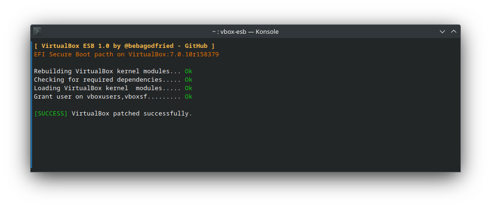

# VirtualBox - ESB v1.0.0
  **[Description]** `VirtualBox - ESB v1.0.0` is a patch for virtualbox: 
  - EFI Secure Boot,
  - vboxdrv, modprob & modules
  - Common errors as (rc=-1908), vboxsf permissions
  - ...

---
    😕 You certainly meet the VirtualBox errors that block you access to your virtual machines due to EFI Secure Boot, USB drivers, and ...
  
  ### Common VirtualBox error
  <!-- rc=-1908 -->
    Kernel driver not installed (rc=-1908)
    The VirtualBox Linux kernel driver is either not loaded or not set up correctly. Please try setting it up again by executing

    '/sbin/vboxconfig'

    as root.

    If your system has EFI Secure Boot enabled you may also need to sign the kernel modules (vboxdrv, vboxnetflt, vboxnetadp, vboxpci) before you can load them. Please see your Linux system's documentation for more information.

    where: suplibOsInit what: 3 VERR_VM_DRIVER_NOT_INSTALLED (-1908) - The support driver is n
---
### How to 'VirtualBox ESB'
- Download the [VirtualBox ESB](https://github.com/bebagodfried/vbox-esb) from GitHub
- Uncompress the downloaded file
- All done. Now patch your virtualbox
  ```
  $ cd /path/to/vbox-esb
  $ sudo chmod 755 *
  $ ./vbox-esb
  ```

### How to add 'VirtualBox ESB' to $PATH
- In terminal, type
  ```
  $ echo "export PATH=$PATH:$PWD" >> ~/.bashrc
  $ bash
  ```
- All done. Now  you can directly run
  ```
  $ vbox-esb
  ```

